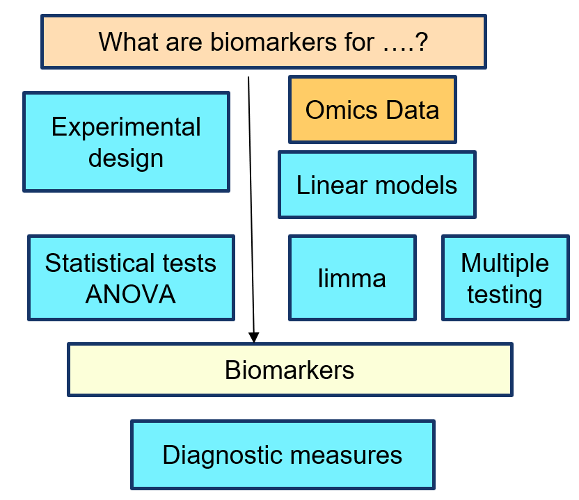

<style type="text/css">
.remark-slide-content {
    font-size: 22px;
    padding: 1em 4em 1em 4em;
}
.left-code {
  color: #777;
  width: 38%;
  height: 92%;
  float: left;
}
.right-plot {
  width: 60%;
  float: right;
  padding-left: 1%;
}
</style>

```{r setup, include=FALSE}
options(htmltools.dir.version = FALSE,
        message=FALSE,warning=FALSE,
        fig.dim=c(4.8, 4.5), fig.retina=2, out.width="100%")
knitr::knit_hooks$set(mysize = function(before, options, envir) {
  if (before) 
    return(options$size)
})
```


# A typical scenario

A common situation in biomedicine and other fields:

- An individual can be in one of two states:  healthy or unhealthy 

- Goal: Detect unhealthy state as son as posible so that preventive actions can be taken.

  - Unhealthyness is not always obvious, particularly at early stages.
  
This situation appears in many contexts, not only nutrition:

- In nutritional studies it is necessary to find out if people have eaten a given nutrient or if they adhere to a certain type of diet, even if there are no nutritional questionaire available.

  - In this case it is common to try to find it out from the analysis of metabolomic data.
---

# Building biomarkers
  
- A (bio)markers for the *unhealthy state*, is *anything*, whose values are different among healthy and unhealthy.
  - Healthy/Unhealthy is only one possibility!
  
- Not anything that differs is a useful biomarker: The difference between conditions must be  *consistent enough* to be used to distinguish each other group, not only on the samples used to build the biomarker but in (any) other independent datasets.
  
- It should happen whith *error rates* *as small as possible* in both
  
  - False positive errors: Declaring unhealthiness in healthy cases
    
  - False negative errors : Declaring health in unhealthy cases

<!-- - A couple of details: -->

<!--   - The biomarker is aimed at finding individuals in unhealthy state. -->

<!--   - Healthy/Unhealthy is only one possibility. A nutritional biomarker may, for instance, be used to distinguish people who has taken wine from those who haven't. -->

---

# The road to biomarkers

- Given a hypothesis about how a certain condition or disease works,

- An experiment must be designed to identify its potential biomarkers.

- Statistical analysis of the experiment results can provide a list of candidate biomarkers. This may require

  - Different statistical methods: Each experimental design may have an ANOVA model suitable for its analysis.
  
  - If *omics* data are used, high dimensionality and, often small sample size has to be accounted for.


- The candidate biomarkers list must be validate against an independent dataset to determine their suitability as biomarkers

---

# The road to biomarkers

```{r echo=FALSE, out.width="80%"}

```

---

class: inverse, middle, center


# Let's go for it!


